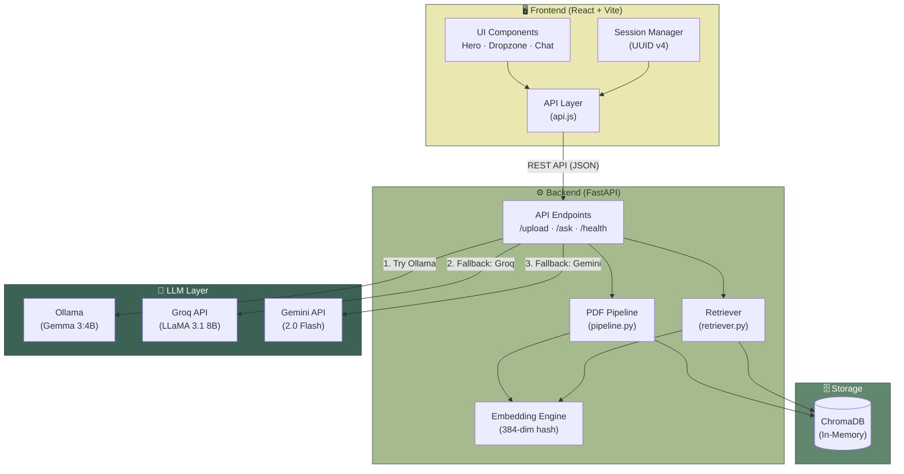
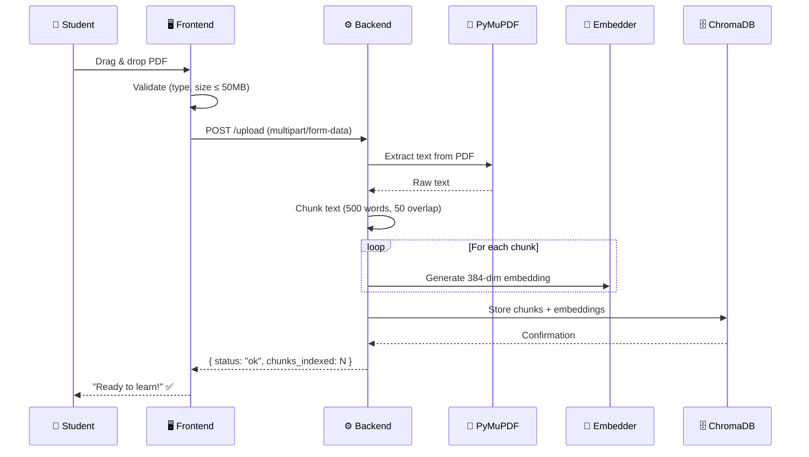
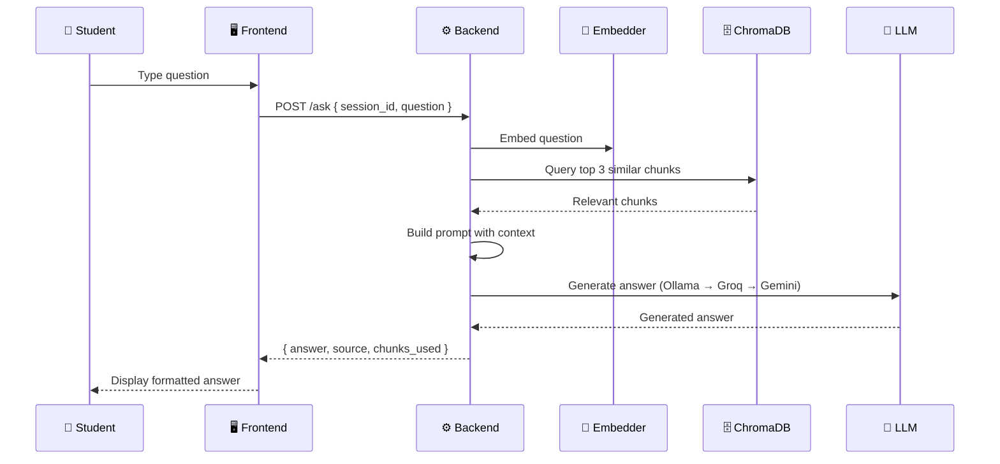

<p align="center">
  
  
  
  
  
  
</p>

<h1 align="center">📖 Vidya AI</h1>

<p align="center">
  <strong>Offline NCERT Tutor for Indian Students — Powered by Gemma 3</strong>
</p>

<p align="center">
  <em>Ask anything from your NCERT textbooks and get instant, curriculum-grounded answers.</em>
</p>

<p align="center">
  <a href="https://vidya-ai-nu.vercel.app">🌐 Live Demo</a> &nbsp;•&nbsp;
  <a href="#-features">✨ Features</a> &nbsp;•&nbsp;
  <a href="#%EF%B8%8F-architecture">🏗️ Architecture</a> &nbsp;•&nbsp;
  <a href="#-getting-started">🚀 Getting Started</a> &nbsp;•&nbsp;
  <a href="#-api-reference">📡 API Reference</a>
</p>

---

## 📌 What It Does

Vidya AI lets students upload their NCERT textbook PDFs, intelligently parses and indexes the content, and then answers questions in natural language — all **offline after initial setup**.

1. **Upload** — Students upload a syllabus-related NCERT PDF.
2. **Parse & Index** — The backend extracts text using PyMuPDF, splits it into overlapping chunks, embeds each chunk, and stores them in ChromaDB.
3. **Ask** — Students ask questions in natural language. The RAG pipeline retrieves the **top 3 most relevant chunks** from ChromaDB.
4. **Answer** — Gemma 3:4B (via Ollama) generates a curriculum-grounded answer using only the retrieved context.

>**NOTE:** \
> **Everything runs locally on your machine.** No data leaves your device when using Ollama. Cloud fallbacks (Groq, Gemini) are optional and only used if Ollama is unavailable.

---

## ✨ Features

| Feature | Description |
| :--- | :--- |
| 🔒 **Fully Offline** | Runs entirely on your machine using Ollama — no internet needed after setup |
| 📄 **PDF Upload & Parsing** | Drag-and-drop PDF upload with real-time progress and validation (max 50 MB) |
| 🧠 **RAG Pipeline** | Retrieval-Augmented Generation with ChromaDB vector store and custom embeddings |
| 💬 **Natural Language Q&A** | Ask questions in plain language and get clear, student-friendly answers |
| ⚡ **Smart Chunking** | Overlapping 500-word chunks with 50-word overlap for context preservation |
| 🔄 **LLM Fallback Chain** | Ollama → Groq → Gemini — automatic failover across providers |
| 🎨 **Modern UI** | Glassmorphism design, smooth animations, responsive layout, and dark/light theming |
| 📱 **Responsive** | Works seamlessly on desktop, tablet, and mobile devices |
| 🗂️ **Session Management** | UUID-based sessions allow multiple concurrent users |

---

## 🌐 Live Demo

> **Try it now without installing anything!**

| | URL |
| :--- | :--- |
| 🖥️ **Frontend** | [vidya-ai-nu.vercel.app](https://vidya-ai-nu.vercel.app) |
| ⚙️ **Backend API** | [vidya-ai-zq1q.onrender.com](https://vidya-ai-zq1q.onrender.com) |

https://github.com/user-attachments/assets/e29b7d20-6041-420e-a447-c3d3b5852671

---

## 🛠️ Tech Stack

| Layer | Technology | Purpose |
| :---: | :--- | :--- |
| **Frontend** | React 19 + Vite 8 | Single-page application with component-based UI |
| **Styling** | Vanilla CSS + Inter (Google Fonts) | Glassmorphism design system with CSS custom properties |
| **Icons** | Lucide React | Lightweight, consistent icon library |
| **Markdown** | react-markdown + remark-gfm | Renders AI answers with formatting support |
| **Backend** | FastAPI (Python) | Async REST API with automatic OpenAPI docs |
| **PDF Parsing** | PyMuPDF (fitz) | Fast, accurate text extraction from PDFs |
| **Embeddings** | Custom hash-based embeddings | Lightweight 384-dimensional vectors — no GPU required |
| **Vector DB** | ChromaDB (in-memory) | Similarity search over document chunks |
| **LLM (Local)** | Gemma 3:4B via Ollama | Primary LLM — runs completely offline |
| **LLM (Cloud)** | Groq (LLaMA 3.1 8B) | First cloud fallback |
| **LLM (Cloud)** | Google Gemini 2.0 Flash | Second cloud fallback |
| **Frontend Hosting** | Vercel | Edge-deployed frontend |
| **Backend Hosting** | Render | Cloud-hosted FastAPI backend |

---

## 🏗️ Architecture

### System Overview



### Data Flow

#### 📤 PDF Upload Flow



#### 💬 Question-Answer Flow



---

## 📁 Project Structure

```
vidya-ai/
├── 📄 README.md
├── 📄 .gitignore
├── 📂 assets/
│   └── 🎬 demo-video.mp4
│
├── 📂 backend/
│   ├── 📄 main.py              # FastAPI app — endpoints, CORS, LLM helpers
│   ├── 📄 pipeline.py           # PDF ingestion — extract, chunk, embed, store
│   ├── 📄 retriever.py          # Similarity search — query ChromaDB for top-K chunks
│   ├── 📄 requirements.txt      # Python dependencies
│   └── 📄 .env                  # Environment variables (not committed)
│
└── 📂 frontend/
    ├── 📄 index.html             # Entry HTML with SEO meta tags
    ├── 📄 package.json           # Node.js dependencies and scripts
    ├── 📄 vite.config.js         # Vite configuration
    └── 📂 src/
        ├── 📄 main.jsx           # React entry point
        ├── 📄 App.jsx            # Root component — routing between upload & chat
        ├── 📄 App.css            # App-level styles
        ├── 📄 api.js             # API client — uploadPDF(), askQuestion()
        ├── 📄 index.css          # Global design system — tokens, animations, glass
        └── 📂 components/
            ├── 📂 Hero/          # Landing page hero section
            ├── 📂 Dropzone/      # PDF drag-and-drop upload with state management
            └── 📂 Chat/          # Chat interface — messages, input, typing indicator
                ├── ChatInterface.jsx
                ├── Header.jsx
                ├── MessageBubble.jsx
                ├── ChatInput.jsx
                └── TypingIndicator.jsx
```

---

## 🚀 Getting Started

### Prerequisites

| Requirement | Version | Purpose |
| :--- | :--- | :--- |
| **Python** | 3.10+ | Backend runtime |
| **Node.js** | 18+ | Frontend build tooling |
| **Ollama** | Latest | Local LLM inference |

### Linux / macOS

**1. Clone the repository**

```bash
git clone https://github.com/ajwaadhussain/vidya-ai.git
cd vidya-ai
```

**2. Pull and start the Gemma model**

```bash
ollama pull gemma3:4b
ollama serve
```

> [!TIP]
> `ollama serve` starts the Ollama daemon on `http://localhost:11434`. Keep this terminal open.

**3. Set up and run the backend**

```bash
cd backend
pip install -r requirements.txt
```

Create a `.env` file (optional — for cloud fallbacks):

```env
OLLAMA_URL=http://localhost:11434
OLLAMA_MODEL=gemma3:4b
GROQ_API_KEY=your_groq_api_key_here        # Optional
GEMINI_API_KEY=your_gemini_api_key_here     # Optional
```

Start the server:

```bash
uvicorn main:app --reload --port 8000
```

**4. Set up and run the frontend**

Open a new terminal:

```bash
cd frontend
npm install
npm run dev -- --host
```

**5. Open the app**

Navigate to `http://localhost:5173` in your browser.  
For LAN access, use `http://<your-device-ip>:5173` (devices must be on the same network).

---

### Windows

**1. Install prerequisites**

- Download and install [Python 3.10+](https://www.python.org/downloads/)
- Download and install [Node.js 18+](https://nodejs.org/)
- Download and install [Ollama](https://ollama.com/download/windows)

**2. Pull and start the Gemma model**

```powershell
ollama pull gemma3:4b
ollama serve
```

**3. Set up and run the backend**

```powershell
cd backend
pip install -r requirements.txt
python -m uvicorn main:app --reload --port 8000
```

**4. Set up and run the frontend**

Open a new terminal:

```powershell
cd frontend
npm install
npm run dev -- --host
```

**5. Open the app**

Navigate to `http://localhost:5173` in your browser.

---

## 📡 API Reference

The backend exposes a RESTful API. Interactive docs are available at `/docs` (Swagger UI) when the server is running.

### `POST /upload`

Upload a PDF file for indexing.

| Parameter | Type | Location | Description |
| :--- | :--- | :--- | :--- |
| `file` | `File` | form-data | PDF file (max 50 MB) |
| `session_id` | `string` | query | Session UUID (default: `"default"`) |

**Response:**

```json
{
  "status": "ok",
  "session_id": "abc-123",
  "chunks_indexed": 42,
  "message": "PDF processed into 42 chunks. Ready to answer questions."
}
```

---

### `POST /ask`

Ask a question about the uploaded PDF.

**Request body:**

```json
{
  "session_id": "abc-123",
  "question": "What is photosynthesis?"
}
```

**Response:**

```json
{
  "answer": "Photosynthesis is the process by which green plants...",
  "source": "ollama",
  "chunks_used": 3
}
```

---

### `GET /health`

Check the health of the backend and LLM availability.

**Response:**

```json
{
  "status": "ok",
  "ollama": true,
  "hf_configured": false
}
```

---

## ⚙️ Environment Variables

| Variable | Default | Description |
| :--- | :--- | :--- |
| `OLLAMA_URL` | `http://localhost:11434` | Ollama server URL |
| `OLLAMA_MODEL` | `gemma3:4b` | Ollama model name |
| `GROQ_API_KEY` | — | Groq API key (optional, for cloud fallback) |
| `GEMINI_API_KEY` | — | Google Gemini API key (optional, for cloud fallback) |
| `HF_API_TOKEN` | — | HuggingFace token (legacy, currently unused) |
| `HF_MODEL` | `google/gemma-3-4b-it` | HuggingFace model (legacy, currently unused) |

---

## 🧩 How the RAG Pipeline Works

```
┌─────────────┐     ┌──────────────┐     ┌──────────────┐     ┌──────────────┐
│  PDF Upload  │────▶│  PyMuPDF     │────▶│  Text        │────▶│  ChromaDB    │
│  (50MB max)  │     │  (Extract)   │     │  Chunking    │     │  (Indexed)   │
└─────────────┘     └──────────────┘     │  500w / 50   │     └──────┬───────┘
                                          │  overlap     │            │
                                          └──────────────┘            │
                                                                      │
┌─────────────┐     ┌──────────────┐     ┌──────────────┐            │
│  Student     │────▶│  Embed       │────▶│  Similarity  │◀───────────┘
│  Question    │     │  Question    │     │  Search      │
└─────────────┘     └──────────────┘     │  (Top 3)     │
                                          └──────┬───────┘
                                                 │
                                          ┌──────▼───────┐     ┌──────────────┐
                                          │  Build       │────▶│  Gemma 3:4B  │
                                          │  Prompt      │     │  (via Ollama)│
                                          └──────────────┘     └──────┬───────┘
                                                                      │
                                                               ┌──────▼───────┐
                                                               │  Student     │
                                                               │  Answer ✅   │
                                                               └──────────────┘
```

---

## 🏆 Acknowledgments

> Built for the **Gemma Sprint by Kaggle + Google DeepMind**.
>
> **Tracks:** Future of Education · Digital Equity · Ollama Special Prize
